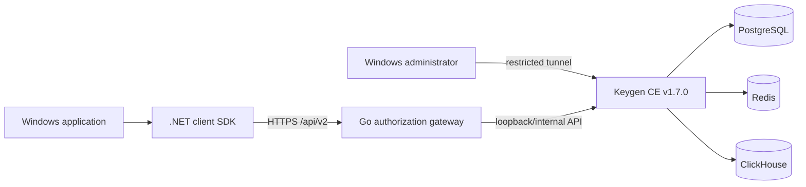

<!-- README_SYNC: README.md <-> README_EN.md -->

# Software License Auth System

面向 Windows 软件的账号授权集成系统，包含 Keygen CE 网关、管理员工具、.NET 客户端 SDK、硬件绑定和短期授权 lease。

本仓库是可构建、可测试的集成开源版。产品专用运行器、正式完整性签名链、生产密钥和客户发布资产不在公开范围内。

[English](README_EN.md)

## 功能

| 模块 | 能力 |
|---|---|
| Go Gateway | 固定 `/api/v2` 操作、严格 JSON、限速、登录退避、超时和错误脱敏 |
| Windows 管理员工具 | 创建账号、首月试用、YEAR/FOREVER 授权、密码重置、机器查询和解绑 |
| .NET 客户端 SDK | 登录、激活、lease 刷新、注销、DPAPI 会话和机器文件验签 |
| 硬件绑定 | 多硬件来源、设备密钥和物理硬件多数匹配 |
| Keygen CE 模板 | 官方 `keygen/api:v1.7.0` 镜像、内部数据库网络、仅 loopback 暴露 |
| 发布门禁 | 阻止私钥、真实配置、数据库、归档、二进制和生产标识进入公开仓库 |

## 授权规则

| 计划 | 业务语义 | 示例价格元数据 |
|---|---|---:|
| `TRIAL` | 首次激活起 30 天免费试用 | 0 |
| `YEAR` | 首次激活起 365 天 | 128 |
| `FOREVER` | 无业务到期时间，仍需刷新短期 lease | 288 |

默认规则是一账号、一用户、一机器。机器文件有效期固定为 3600 秒，客户端按服务端返回值刷新。价格是授权元数据示例，本仓库不包含支付系统。

## 架构



客户端只接触四个固定操作：

- `POST /api/v2/login`
- `POST /api/v2/activate`
- `POST /api/v2/lease`
- `POST /api/v2/logout`

客户端不能提交任意上游 URL、HTTP 方法或 lease TTL。详细边界见 [架构文档](docs/architecture.md) 和 [API 文档](docs/api.md)。

## 目录

```text
gateway/                 Go 授权网关
admin/                   Windows 管理员工具与测试
client-sdk/              .NET 客户端 SDK 与测试
examples/windows-demo/   通用 WinForms 演示
deploy/keygen/           Keygen CE Compose 模板
docs/                    架构、API、部署和安全文档
scripts/                 公开发布与文档同步门禁
```

## 快速验证

环境要求：Go 1.26、.NET 8 SDK、PowerShell 5.1+；验证 Compose 时需要 Docker Compose。

```powershell
Push-Location .\gateway
go test ./...
go vet ./...
Pop-Location

dotnet test .\admin\tests\SoftwareLicenseAuth.Admin.Tests.csproj -c Release --nologo
dotnet test .\client-sdk\tests\SoftwareLicenseAuth.Client.Tests.csproj -c Release --nologo
dotnet build .\examples\windows-demo\SoftwareLicenseAuth.Demo.csproj -c Release --nologo

powershell -NoProfile -ExecutionPolicy Bypass -File .\deploy\keygen\test-compose.ps1
powershell -NoProfile -ExecutionPolicy Bypass -File .\scripts\test-docs.ps1
powershell -NoProfile -ExecutionPolicy Bypass -File .\scripts\test-public-release.ps1
powershell -NoProfile -ExecutionPolicy Bypass -File .\scripts\verify-public-release.ps1
```

## 本地演示

1. 构建 `examples/windows-demo`。
2. 在输出目录中将 `auth-config.example.json` 复制为 `auth-config.json`。
3. 将示例网关地址、Keygen 公钥、账号 ID 和产品 ID 替换为你自己的测试值。
4. 启动 `SoftwareLicenseAuth.Demo.exe`。

演示程序只显示授权状态、计划、机器 ID 和短期 lease 到期时间，不显示 session token 或机器文件。

## 部署

- Keygen CE 模板见 [`deploy/keygen`](deploy/keygen/README.md)。
- Gateway 必须保持 loopback 监听，并由 TLS 反向代理提供公网 HTTPS。
- 管理员工具需要独立的本地配置、受限 SSH 隧道账号和主机密钥固定。
- 不要提交 `.env`、`admin-config.json`、`auth-config.json`、DPAPI 文件或任何生产凭据。

完整步骤和回滚方式见 [部署文档](docs/deployment.md)。

## 安全边界

账号、授权、机器关系和有效期由服务端决定。客户端使用多硬件指纹、设备密钥、DPAPI 会话、Ed25519 机器文件验签和 `LICENSE-AUTH-LEASE-V1` 绑定，但任何客户端保护都不能保证不可破解。短期 lease 的作用是缩短被复制或篡改客户端的离线有效窗口。

安全设计和报告方式见 [安全文档](docs/security.md) 与 [SECURITY.md](SECURITY.md)。

## 许可证

- 原创集成代码：`AGPL-3.0-only`，完整文本见 [LICENSE](LICENSE)。
- Keygen CE `keygen/api:v1.7.0`：独立适用 `FCL-1.0-ALv2`，见 [Keygen FCL](deploy/keygen/LICENSE_KEYGEN_FCL.md)。
- 闭源集成、私有部署和商业例外：见 [COMMERCIAL-LICENSE.md](COMMERCIAL-LICENSE.md)。
- 其他依赖：见 [THIRD_PARTY_NOTICES.md](THIRD_PARTY_NOTICES.md)。

## 参与贡献

提交前请运行全部测试和公开发布门禁。不要在 Issue、日志、测试夹具或提交历史中放入真实凭据和客户数据。详情见 [CONTRIBUTING.md](CONTRIBUTING.md)。

---

商务合作 / 软件授权接入 / 私有部署

QQ群：924211252
