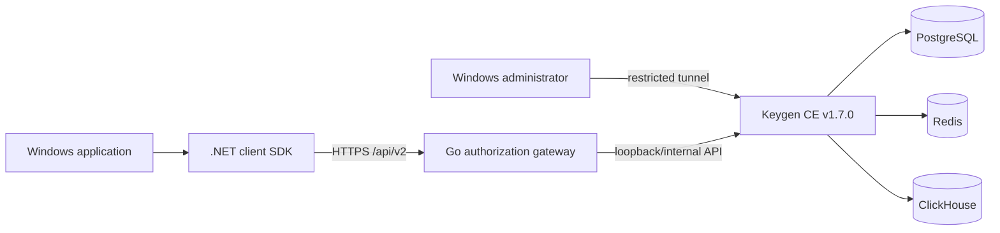

<!-- README_SYNC: README.md <-> README_EN.md -->

# Software License Auth System

An account-based licensing integration system for Windows software, with a Keygen CE gateway, administrator tool, .NET client SDK, hardware binding, and short authorization leases.

This repository is a buildable and testable integration edition. Product-specific runners, the production integrity-signing chain, production keys, and customer release assets are not public.

[中文](README.md)

## Features

| Module | Capabilities |
|---|---|
| Go Gateway | Fixed `/api/v2` operations, strict JSON, rate limits, login backoff, bounded timeouts, and sanitized errors |
| Windows administrator | Account creation, first-month trial, YEAR/FOREVER licensing, password reset, machine lookup, and unbinding |
| .NET client SDK | Login, activation, lease refresh, logout, DPAPI sessions, and machine-file verification |
| Hardware binding | Multiple hardware sources, a device key, and physical-hardware majority matching |
| Keygen CE template | Official `keygen/api:v1.7.0` image, internal data networks, and loopback-only publishing |
| Release guard | Blocks private keys, real configuration, databases, archives, binaries, and production identifiers |

## License plans

| Plan | Business semantics | Example price metadata |
|---|---|---:|
| `TRIAL` | 30 free days from first activation | 0 |
| `YEAR` | 365 days from first activation | 128 |
| `FOREVER` | No business expiry; short leases still refresh | 288 |

The default policy is one account, one user, and one machine. Machine files are valid for exactly 3600 seconds and clients refresh according to the server response. Prices are licensing metadata examples; this repository does not include payment processing.

## Architecture



The client can call only four fixed operations:

- `POST /api/v2/login`
- `POST /api/v2/activate`
- `POST /api/v2/lease`
- `POST /api/v2/logout`

Clients cannot provide arbitrary upstream URLs, HTTP methods, or lease TTL values. See [Architecture](docs/architecture.md) and [API](docs/api.md) for the trust boundaries.

## Repository layout

```text
gateway/                 Go authorization gateway
admin/                   Windows administrator tool and tests
client-sdk/              .NET client SDK and tests
examples/windows-demo/   Generic WinForms demo
deploy/keygen/           Keygen CE Compose template
docs/                    Architecture, API, deployment, and security docs
scripts/                 Public-release and documentation guards
```

## Quick verification

Requirements: Go 1.26, .NET 8 SDK, and PowerShell 5.1+. Docker Compose is required to validate the Compose model.

```powershell
Push-Location .\gateway
go test ./...
go vet ./...
Pop-Location

dotnet test .\admin\tests\SoftwareLicenseAuth.Admin.Tests.csproj -c Release --nologo
dotnet test .\client-sdk\tests\SoftwareLicenseAuth.Client.Tests.csproj -c Release --nologo
dotnet build .\examples\windows-demo\SoftwareLicenseAuth.Demo.csproj -c Release --nologo

powershell -NoProfile -ExecutionPolicy Bypass -File .\deploy\keygen\test-compose.ps1
powershell -NoProfile -ExecutionPolicy Bypass -File .\scripts\test-docs.ps1
powershell -NoProfile -ExecutionPolicy Bypass -File .\scripts\test-public-release.ps1
powershell -NoProfile -ExecutionPolicy Bypass -File .\scripts\verify-public-release.ps1
```

## Local demo

1. Build `examples/windows-demo`.
2. In the output directory, copy `auth-config.example.json` to `auth-config.json`.
3. Replace the example gateway URL, Keygen public key, account ID, and product ID with your own test values.
4. Start `SoftwareLicenseAuth.Demo.exe`.

The demo displays only authorization state, plan, machine ID, and short-lease expiry. It never displays a session token or machine file.

## Deployment

- The Keygen CE template is under [`deploy/keygen`](deploy/keygen/README.md).
- Keep the Gateway on loopback and publish it through a TLS reverse proxy.
- The administrator tool requires local configuration, a restricted SSH tunnel account, and pinned host keys.
- Never commit `.env`, `admin-config.json`, `auth-config.json`, DPAPI files, or production credentials.

See [Deployment](docs/deployment.md) for setup and rollback details.

## Security boundary

Accounts, licenses, machine relationships, and expiry are decided by the server. The client uses multi-source hardware fingerprints, a device key, DPAPI sessions, Ed25519 machine-file verification, and `LICENSE-AUTH-LEASE-V1` binding, but no client-side protection can guarantee that software is unbreakable. Short leases reduce the offline lifetime of copied or modified clients.

See [Security](docs/security.md) and [SECURITY.md](SECURITY.md) for design details and reporting.

## Licensing

- Original integration code: `AGPL-3.0-only`; see [LICENSE](LICENSE).
- Keygen CE `keygen/api:v1.7.0`: independently covered by `FCL-1.0-ALv2`; see [Keygen FCL](deploy/keygen/LICENSE_KEYGEN_FCL.md).
- Closed-source integration, private deployment, and commercial exceptions: [COMMERCIAL-LICENSE.md](COMMERCIAL-LICENSE.md).
- Other dependencies: [THIRD_PARTY_NOTICES.md](THIRD_PARTY_NOTICES.md).

## Contributing

Run the full test suite and public-release guard before submitting changes. Never place real credentials or customer data in issues, logs, fixtures, or Git history. See [CONTRIBUTING.md](CONTRIBUTING.md).

---

Commercial integration / Private deployment / Custom licensing

QQ group: 924211252
