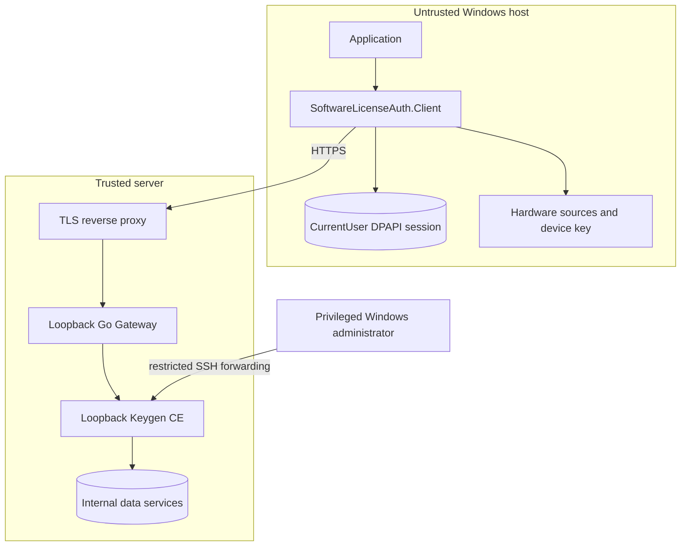
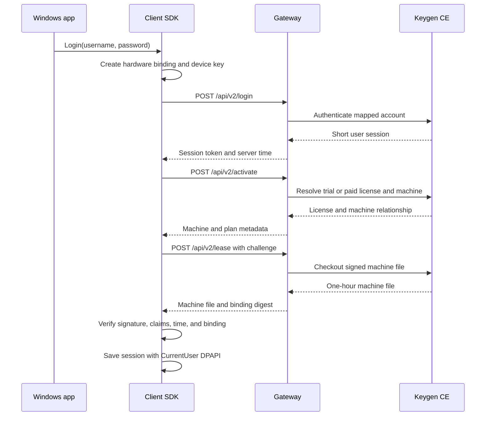

# Architecture

## Components

| Component | Responsibility | Trust level |
|---|---|---|
| Windows application | Presents the product UI and calls the client SDK | Untrusted client environment |
| Client SDK | Builds device identity, stores the session, requests and verifies short leases | Untrusted but hardened client code |
| Go Gateway | Exposes four fixed operations and enforces the product/account/device contract | Trusted server boundary |
| Administrator tool | Creates users and licenses and manages machine relationships | Privileged operator boundary |
| Keygen CE | Stores users, licenses, machines, policies, and signed machine files | Trusted licensing data plane |
| PostgreSQL/Redis/ClickHouse | Keygen persistence, cache, and analytics | Internal infrastructure only |

## Topology



## Identity model

1. The administrator normalizes a username and maps it to an internal Keygen email under `@accounts.license.invalid`.
2. The Gateway applies the same normalization before Keygen login.
3. The client never receives another user's password, license key, machine file, or session.
4. Keygen relationships bind one user, one license, and one machine under the configured product.

The account email is an internal mapping key, not a deliverable email address.

## Authorization flow



## Plan semantics

- `TRIAL`: 30 days from first activation, price metadata `0`.
- `YEAR`: 365 days from first activation, price metadata `128`.
- `FOREVER`: no business expiry, price metadata `288`.
- Every plan still uses a one-hour machine file and periodic refresh. `FOREVER` does not mean an unlimited offline token.

The Gateway accepts only the expected plan/price combinations. Payment collection is outside this repository.

## Device binding

The client derives a binding from SMBIOS UUID, baseboard, BIOS, system disk, machine GUID, and a CNG device key. The server stores the submitted components and later requires the physical-component majority contract. The machine file contains signed account, product, license, machine, user, fingerprint, issued-at, and expiry claims.

The lease binding digest uses:

```text
LICENSE-AUTH-LEASE-V1\0<machine-file>\0<manifest-sha256>\0<challenge>
```

The client verifies that digest, the Ed25519 machine-file signature, server time, persisted last server time, and exact one-hour expiry before saving the session.

## Deliberate exclusions

The public repository does not contain a product runner, private integrity signing keys, a production manifest pipeline, Frida patches, customer packages, virtual machines, production endpoints, or live configuration. Those exclusions keep the integration example reusable and prevent production material from entering Git history.
